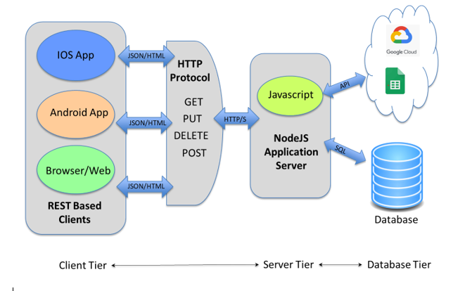

**Hunterdon Central Regional High School**

**Lavatory Checkin**  **Automation Project**

**Introduction**

This document provides an overview of a software development project that is underway to improve the current approach for tracking students who enter lavatories across the school.   The current process revolves around maintaining a google-sheets for each individual lavatory.   The teacher who is providing lavatory duty is responsible for collecting id&#39;s, typing name in and some other information.   Then when a student exits the lavatory the teacher then checks them out.   On some periodic basis the data is archived out of the google-sheet into a history file.  This process is error prone, labor intensive and lacks some fundamental controls to ensure the quality of the data.

The project can be thought of in 3 phases :

1. Initial development and deployment on top of google-sheets.
2. Migration to a SQL based back end database
3. Maintenance mode with student engagement and development

The first phase will focus on improving convenience for the teachers.  It will come with a web-based interface for checking students in and out of the Lav.  It will also come with an IOS and Android app for reading bar codes and checking students in and out.    This will improve controls in that teachers will not make mistakes typing names in.

The second phase will migrate off the google-sheet back end and manage the data in a database.  This migration should be seamless to the teachers but should make the administration of the data much easier.  There will not be a need to migrate data out of the sheets into a history file.   The controls around data typing will also be improved as database columns will come with constraints that protect the integrity of the information being put into the database.

The third phase is a little vague at this point but it will emphasize getting students involved in the development and maintenance process of the platform.   The system has been designed in such a way that it utilizes technologies that aspiring computer scientist need to learn and can contribute to.

**System Architecture**

 

The system architecture comes in a standard 3-tiered architecture.  Multi-tier architectures are common place in technology and this approach gives a clean migration path, ability to incrementally build out until end state and leverages technologies that aspiring Computer Programmers will need to know on their educational adventures.

**Client Tier**

From left to right, the first tier is the **&quot;Client Tier&quot;.**  This tier is named this way because it is the tier or &quot;layer&quot; that the end user or client of the software interacts with the system.   There will be three applications for the users to interact with the system, 2 applications for personal devices and a browser-based web client.

The 2 applications will provide the same functionality but will capable of running on IOS and Android respectively.    These applications will provide standard check in and check out functionality but will highlight bar-code reader capabilities for convenience.      The applications will be developed utilizing **expo.io** development platform.  This platform is used to write cross platform code that ultimately compiles on mac for ios and windows/unix for android.    The coding language is **javascript**.   Both expo.io and javascript are already leveraged by students within HCRHS across the curriculum and computer science club.

These applications will need to be deployed to the App Store for Apple IOS  and Google Play for Android.

The browser-based web client will be developed in **Node.js** and **Express.js**.  These are both javascript utilities that are common place in the industry.   This source code will be hosted in production on the server side Node.js server discussed below.

**Server Tier**

The middle tier is the **&quot;Server Tier&quot;** and hosts the communication mechanism with the client-tier.   The technology for this is a javascript module called **Node.js**.    This module in combination with **Express.js** are used to produce the browser-based client web screens.  But, they are also used to host standard **REST services**.   REST (Representational State Transfer) services are a web-based standard that utilizes http protocol and exchanges information in **JSON** (JavaScript Object Notation) format.  The REST services will be that **API** (Application Programmer Interface) for the 3 client-tier tools to accessing and managing the lavatories.

The REST services will interact with the third tier for data management.  The intention of these services is to abstract or isolate the user tier from the type of database that the data is stored in.    There will be access libraries for javascript installed on the Node.js server to utilize to read and write data to the google-sheets.  Ultimately, there will also be a library installed to support SQL access to the database server.

**Database Tier**

This third tier is the **&quot;Database Tier&quot;** and hosts data storage.   Currently, the storage is in the Google Cloud that hosts our google-sheets.  The api that is in the Node.js server provides access to read and write to the google-sheets.     During phase 2 of the project the google-sheets will be swapped out for a database.  Most likely the database will be SQL based and hosted on windows.

**Specifications**

Below are listed a few of the specifications of the technologies and hardware we will be leveraging:

Client Tier

- App Store for Apple to host IOS Application
- Google Play for Android to host Android Application
- Expo.io to develop and port Android and IOS Applications in javascript

Server Tier

- Node.js, Express.js running on a windows based machine to host web-client javascript
- Google-sheet javascript library to access Google Cloud
- Ultimately, a SQL javascript library to access a SQL based database

Database

- Google Cloud Project with authentication keys to access Google Cloud
- Google-sheet access for Google Cloud Project email-id
- Ultimately, a SQL based database ( SQL Server) hosted on a windows machine

Source Code Control

- Git hub project to host source code and change control

**Phase III**

Ultimately, Phase III of the project will be a phase where students participate in the development process.  It is still to-be-determined as to what constructs the students will participating.  But, given the design of the system and the technologies used, participation in further development will be of educational value to students.   Once we get to phase III, we will need a development server to host test versions of the application before we move it into production.   We will also need test versions of the database server that will house the data.    The construct of this phase will need to be matured and collaborated to ensure the best possible experience for students.